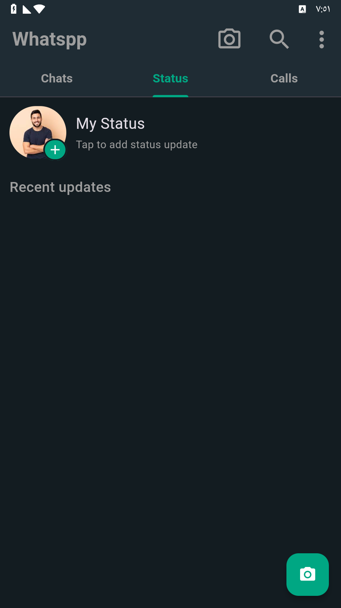
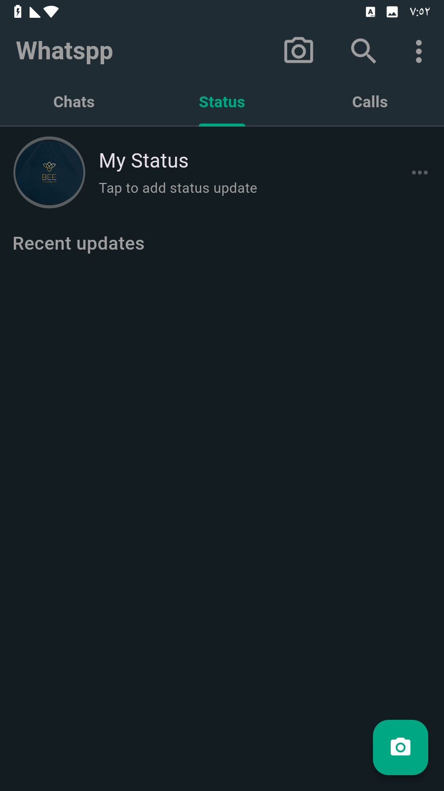

# whatsapp_clone
This is an app that mimics the Whatsapp app In this application, I used clean architecture g to build the application and made sure that the application was responsive, and used firebase as backend, and used in this application push notification and many features that made sure that I was producing an application similar to WhatsApp to develop my ability to build applications of this size

## Screens :

    
    

    
    

    
    

    
    

    
   

    
    
   

